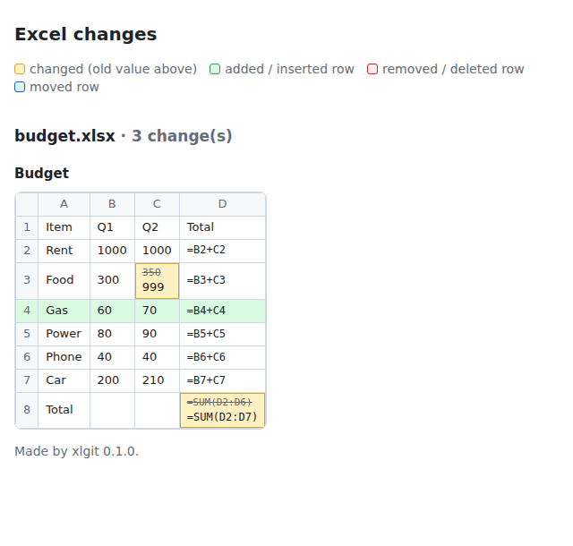

# xlgit

**Git diff and merge for Excel.** Two people edit the same workbook on their own branches, and git merges it cell by cell. Charts, tables, pivot tables and macros come through intact, and only a cell you both changed is a conflict.

Other Excel version control tools show you what changed and then leave the merging to you, by hand. As far as I know, xlgit is the only free, open-source tool that merges two versions of a workbook automatically and keeps everything in it working. [How it compares](#how-it-compares) has the details.


## Try it in 30 seconds

```bash
pip install xlgit
xlgit demo
```

`xlgit demo` works in a throwaway folder and touches nothing else: Anna inserts a line in a cost estimate, Ben changes a rate and a quantity on his branch, and git merges them, with Ben's edits following their rows down. No Python? Grab the program for your computer from the [latest release](https://github.com/MichaelFowler1/excel-git/releases/latest) and run `xlgit demo` with it.

When you're ready to use it on your own files, run `xlgit install` once. [Get started](#get-started) has the details.

> Beta (0.1.1). The merge has been fuzz-tested against about 3,000 real-world workbooks, but you'll still find cases it gets wrong. Git keeps every version, so a bad merge can always be undone. Please [open an issue](https://github.com/MichaelFowler1/excel-git/issues) when something looks wrong.

## What you get

| | Without xlgit | With xlgit |
|---|---|---|
| `git diff` | `Binary files differ` | `changed Budget!B2 1000 -> 1100`, plus inserted, deleted and moved rows, and chart, image and comment changes |
| Seeing changes | n/a | `xlgit diff --html`: the sheet as a grid in your browser, changes highlighted |
| Merge, different cells edited | conflict, pick one whole file | merges cleanly |
| Merge, one side inserted rows | conflict | the other side's edits follow their rows |
| Merge, same cell edited | conflict | conflict on just that cell, listed in a `_merge_conflicts` sheet with a link to it |
| Charts, images, comments, formatting, macros | n/a | kept, and their edits to them carried over |
| Tables and pivot tables | n/a | merged: you add rows, they add a column, you get both |
| Pull request on GitHub | "binary file not shown" | bot comment with a table of every changed cell, chart, table and pivot |

Formulas are compared as formulas (`=B2+C2`), not their cached results.

## How it compares

People have wanted this for a long time, and there are good tools that get part of the way. Here's where each one stops:

| | Shows what changed | Merges two versions automatically | Keeps charts, tables, pivots | Free and open source |
|---|---|---|---|---|
| **xlgit** | cells, rows, charts, tables, pivots | yes, cell by cell | yes | yes (Apache-2.0) |
| [xltrail](https://www.xltrail.com/) | yes | no: its own guide merges by copying changes across by hand | n/a | no, paid |
| [xlCompare](https://xlcompare.com/) | yes | no: you pick each change in a side-by-side window | n/a | no, paid (Windows) |
| [Git XL](https://github.com/xltrail/git-xl) | VBA macro code only | no | n/a | yes |
| [daff](https://github.com/paulfitz/daff) | yes, for tables | yes, but for CSV files, not workbooks | no (CSV has none) | yes |
| [exceldiff](https://github.com/MinamiyamaKotaro/exceldiff) | yes, as pull request comments | no | n/a | yes (AGPL) |
| Excel co-authoring (OneDrive, SharePoint) | version history | no branches: everyone edits one live copy | yes | no, part of Microsoft 365 |

Checked in September 2026 against each tool's own documentation. If something here is wrong or out of date, please [open an issue](https://github.com/MichaelFowler1/excel-git/issues) and it'll be fixed.

Co-authoring is great when a team can edit one copy at the same time. xlgit is for when they can't or shouldn't: work on separate copies or branches, review the change, then merge it.

### Why it's hard, and how xlgit does it

A workbook isn't one file. It's a zip of dozens of XML parts that point at each other, and Excel renumbers them every time it saves. A merge that re-saves the workbook through a spreadsheet library quietly drops the charts and pivots that library doesn't understand, which is why automatic merging has been left alone. xlgit works on the XML directly: it starts from your copy, matches objects between versions by what they are rather than their file names, and only rewrites the parts that changed. [How the merge works](#how-the-merge-works) goes into detail.

It's tested the hard way: 69 automated tests on Windows, macOS and Linux, and a fuzzer that makes random edits to real-world workbooks on two branches, merges them and checks nothing was lost. It has run over about 3,000 of them so far, from the Enron corpus and other spreadsheet libraries' test files, and every bug it found is fixed.

## Get started

You need git. Then, once per computer, either:

**With Python** (3.9 or newer):

```bash
pip install xlgit
xlgit install
```

**Without Python:** download the program for your computer from the [latest release](https://github.com/MichaelFowler1/excel-git/releases/latest) (`xlgit-windows.exe`, `xlgit-macos-arm64` for Apple silicon, `xlgit-macos-intel`, `xlgit-linux`), rename it to `xlgit` (`xlgit.exe` on Windows), put it somewhere it will stay, and run `xlgit install`. On Windows you can also just double-click it and it offers to set itself up. The downloads aren't code-signed yet: on Windows click "More info" then "Run anyway"; on a Mac, right-click it, choose Open, then Open again. If you move the program later, run `xlgit install` again.

That's it. Every git repository on this computer now understands `.xlsx` and `.xlsm` files, including ones you clone or create later. Keep using git the way you already do.

To also get a comment listing the changed cells on every GitHub pull request, run this once inside the repository and push:

```bash
xlgit install --github
```

Run `xlgit` on its own at any time to see the commands and check that everything is set up.

## Everyday use

**See what changed.** `xlgit diff` lists every cell that changed in your workbooks since the last commit. Inserted, deleted and moved rows show up as rows, not as every cell below them changing. `git diff`, `git log -p` and `git show` show cell changes too.

```
$ xlgit diff
=== budget.xlsx ===
changed        Budget!C3  350 -> 999
row inserted   Budget row 4  A: 'Gas', B: 60, C: 70, D: =B4+C4
changed        Budget!D8  =SUM(D2:D6) -> =SUM(D2:D7)
```

`xlgit diff --html` opens the same changes in your browser, laid out like the spreadsheet:



**Merge.** `git merge` and `git pull` combine edits from both branches cell by cell. If you changed different cells, there's nothing to do.

**When both of you changed the same cell**, git stops and xlgit tells you which cells:

```
xlgit merged budget.xlsx: took 3 cell(s) from the other branch, but 1 change(s) clash.
  Budget B2: yours 1100, theirs 1200 (was 1000)
  Your values were kept. Every clash is listed, with a link, on the sheet '_merge_conflicts'.
```

Open the workbook, go through the `_merge_conflicts` sheet (each row links to its cell), fix the cells, delete that sheet, save, then run `git add budget.xlsx` and `git commit`. Git keeps every version, so nothing is ever lost: `git merge --abort` undoes the whole merge.

## Found a problem?

Please [open an issue](https://github.com/MichaelFowler1/excel-git/issues/new/choose). Bug reports on real workbooks are the most useful thing you can give this project, and you don't have to share your data to do it:

```bash
xlgit scrub --merge budget.xlsx     # during a merge that went wrong: base, yours, theirs, in one zip
xlgit scrub old.xlsx new.xlsx       # any workbooks, e.g. for a wrong diff
```

`scrub` makes copies where every number, piece of text, comment, chart label and file property is replaced with made-up values, keeping formulas, layout, charts, tables and pivots, so the problem still shows up. Equal values stay equal across the files scrubbed together. Sheet names and named ranges are kept (formulas refer to them), macros are removed, and images are replaced with blank ones. Open the copies and check them before you share them.

## How the merge works

A workbook is a zip of XML files: one per sheet, one per chart, one per image and so on. Instead of re-saving the whole thing through a spreadsheet library (which is how charts used to get lost), xlgit starts from your copy's zip and only rewrites the XML that has to change:

- **Cells**: 3-way merge cell by cell. A cell only one side changed takes that side's value.
- **Rows**: if one branch inserted, deleted or moved rows and the other edited cells, the edits land on the rows where their cells ended up, with formula references renumbered the way Excel does it. An edit to a row the other branch deleted is a conflict.
- **Charts, images, comments, macros**: 3-way merge object by object. If only their branch changed a chart, you get their version. If both did, yours is kept and it's flagged as a conflict. Chart edits caused by cell changes (Excel caches plotted values inside the chart) don't count as edits.
- **Tables**: merged field by field. Their new column plus your new rows gives a table with both. Tables added on their branch come over, and if both branches added a `Table2`, theirs is renamed `Table3` and their formulas are updated to match.
- **Pivot tables**: a pivot, its data cache and the cached records merge as one bundle. A branch that only refreshed a pivot (same layout, new data) doesn't count as an edit, so your data change and their "switch to Average" merge cleanly. New pivots from their branch come over, sharing an existing cache when they used one.
- **Sheets**: new sheets on their branch come over whole, with their charts, tables and pivots. Renames and deletes merge too.
- **Named ranges**: merged by name.

Writers renumber a workbook's internal files on every save (add a chart to an early sheet and every later `chart1.xml` becomes `chart2.xml`). xlgit matches objects by what they are, like "the chart called Chart 1 on sheet Notes" or "table id 3", not by file name, so renumbering doesn't cause false conflicts.

Excel recalculates every formula and refreshes affected pivot tables when it opens the merged file.

## Commands

```
xlgit                        help, and whether everything is set up
xlgit install                set up every repository on this computer (once)
xlgit install --github       add pull request comments to this repository
xlgit install --repo         set up only this repository
xlgit uninstall [--repo]     undo the setup
xlgit diff                   what changed in your workbooks since the last commit
xlgit diff FILE              ... in one workbook
xlgit diff OLD NEW           compare any two workbooks (--markdown for a table)
xlgit diff --html [FILES]    open the changes in your browser (--out=page.html to save it)
xlgit scrub FILE...          copies with every value made up, safe to attach to a bug report
xlgit scrub --merge FILE     the three versions of a merge that went wrong, scrubbed, in one zip
xlgit demo [FOLDER]          two people edit one workbook and git merges it, in a throwaway folder
xlgit --version
```

Git runs `xlgit textconv` and `xlgit merge` itself; you don't need to.

Don't want a package? `xlgit.py` is a single file. Copy it in, `pip install openpyxl lxml`, and run `python xlgit.py install`.

### The GitHub Action

`xlgit install --github` writes this workflow. You can also add it by hand:

```yaml
# .github/workflows/excel-diff.yml
name: Excel diff
on:
  pull_request:
    paths: ["**/*.xlsx", "**/*.xlsm"]
permissions:
  contents: read
  pull-requests: write
jobs:
  excel-diff:
    runs-on: ubuntu-latest
    steps:
      - uses: actions/checkout@v4
        with:
          fetch-depth: 0
      - uses: MichaelFowler1/excel-git@v0.1.1
```

It keeps one comment per pull request up to date as you push. Pull requests from forks can't be commented on with GitHub's default token, so for those the changed cells go in the run's summary page instead.

## Tests

```bash
pip install -r requirements-dev.txt
python -m pytest tests
```

The tests build workbook versions with charts, comments and named ranges, run real `git merge` through the driver, and check every object survived. Set `XLGIT_KEEP=some/dir` to keep the merged files and open them in Excel yourself.

### Fuzzing against real workbooks

`fuzz/merge_fuzz.py` runs the merge over a folder of real spreadsheets. For each one it makes two branches with random cell edits, merges them, and checks the result: it opens, every edit from both sides is there with its exact type and value, nothing else changed, no chart, table or pivot was lost, and the conflicts reported are exactly the cells both sides changed.

```bash
pip install py7zr
fuzz/fetch_corpus.sh corpus            # ~17,000 workbooks: Enron corpus + open-source test suites
python fuzz/merge_fuzz.py corpus --keep failed/
```

`--keep` saves the base, ours, theirs and merged files of every failure. `--rounds N` tries N different random edits per workbook.

## Limits

- Formatting changes their branch made to existing cells come over only when both branches have the same set of styles. Otherwise your formatting is kept.
- Column widths, merged cells and conditional formatting on existing sheets aren't merged. Yours are kept.
- Until Excel refreshes a merged pivot, the numbers in its cells are the old ones. Excel does this on open, but tools that read the file without Excel (pandas, openpyxl) see the stale values.
- Slicers, timelines and tables linked to external data connections aren't merged. They're reported as conflicts so nothing disappears silently.
- If both branches added a chart to a sheet that had none, only yours is kept (flagged).
- Inserted and deleted rows are followed when only one branch changed a sheet's rows. If both branches inserted or deleted rows on the same sheet, that sheet merges cell by cell, and cells that only moved can show up as conflicts.
- Rows are recognised by their contents. A row change can't always be recognised (say, deleting one of many identical rows); then the sheet merges cell by cell and anything unclear is reported as a conflict, never guessed.
- Inserted columns show as changed cells for now.
- `.xls` (the old pre-2007 format) isn't supported. Save as `.xlsx`.

## Roadmap

Done so far: fuzz testing against real workbooks and following inserted, deleted and moved rows. Next up: code review for spreadsheets: showing what a change does to the numbers, tests that run on every pull request, and a linter. See [ROADMAP.md](https://github.com/MichaelFowler1/excel-git/blob/main/ROADMAP.md).

## License

Apache License 2.0. See [LICENSE](https://github.com/MichaelFowler1/excel-git/blob/main/LICENSE).

You can use, change and ship xlgit, including commercially. If you pass it on, modified or not, keep the [NOTICE](https://github.com/MichaelFowler1/excel-git/blob/main/NOTICE) file and the copyright line at the top of `xlgit.py` with it. The license doesn't grant use of the xlgit name for your own version.

Created by Michael Fowler.
